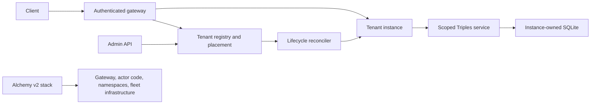

# Isolated tenant hosting for Triplex

Status: proposal, researched September 6, 2026. This document plans the work; it does not
implement or deploy a hosting service. Package and API names below are provisional.

## Recommendation

Build an optional hosting layer **above `Triples`, in the Triplex package family, outside
`@bjacobso/triplex` core**. Start with one SQLite-backed Cloudflare Durable Object per tenant
database, validate the same host on celld, then add a Rivet actor adapter. Use Alchemy v2 to
deploy the fleet and its infrastructure; use a runtime control plane to provision tenants.

The useful abstraction is an **isolated Triplex instance**: a stable database identity,
durable storage, a scoped `Triples` runtime, an authenticated endpoint, and an explicit
lifecycle. The storage engine remains Triplex. Hosting chooses where it lives and who may
reach it.

Assume initially that tenants run trusted application code with separate data. A tenant
does not upload JavaScript. Separate databases do not imply separate machines, accounts,
encryption keys, resource guarantees, or protection from a compromised host. Dedicated
deployments can be a later isolation tier.

## What already exists

- [ARCHITECTURE.md](ARCHITECTURE.md) requires a one-way graph: backend packages depend on core;
  core cannot depend on a backend. Authorization and application lifecycle are host-owned.
- Core already supplies atomic transactions, command receipts, a durable journal, scoped
  pagination, configuration releases, and checkpoints. Hosting should compose these guarantees.
- [The Cloudflare package](packages/cloudflare/README.md) is private and experimental. It has
  a storage adapter using `storage.sql` and `storage.transactionSync()`, but lacks a complete
  public `Triples` layer and shared backend conformance.
- [CloudflareDatabaseManager](packages/cloudflare/src/services/CloudflareDatabaseManager.ts)
  assumes routing has already selected the database and ignores the supplied database name.
  It is an internal shim, not a tenant registry or authorization boundary.
- [SqliteTriples](packages/sqlite/src/SqliteTriples.ts) demonstrates backend-owned composition
  and database cursor scoping. Its Node SQLite driver cannot simply run inside a Durable Object
  or substitute for Rivet's actor-owned database.
- [pnpm-workspace.yaml](pnpm-workspace.yaml) already pins Alchemy `2.0.0-beta.76` and Effect
  `4.0.0-rc.112`. [alchemy.run.ts](alchemy.run.ts) uses `Alchemy.Stack`, Effect, and Cloudflare
  providers to deploy documentation. Tenant hosting should have a separate stack and state
  identity from the documentation site.

See [current-state.md](docs/current-state.md) for the existing maturity claims. This plan
does not promote the Cloudflare backend to supported status.

## Package ownership

| Location                                               | Responsibility                                                                                | Dependency direction                                                         |
| ------------------------------------------------------ | --------------------------------------------------------------------------------------------- | ---------------------------------------------------------------------------- |
| `packages/core` / `@bjacobso/triplex`                  | Database semantics and existing storage contracts                                             | Effect; no hosting, provider SDK, or Alchemy dependency                      |
| `packages/sql` / `@bjacobso/triplex-sql`               | Shared SQL migrations and query execution                                                     | Core                                                                         |
| `packages/cloudflare` / `@bjacobso/triplex-cloudflare` | Complete Durable Object SQLite `Triples` composition                                          | Core; SQL where reusable                                                     |
| Proposed `packages/host` / `@bjacobso/triplex-host`    | Portable tenant identity, authorization contracts, instance lifecycle, protocol, and handlers | Public core APIs and Effect                                                  |
| Proposed `packages/rivet` / `@bjacobso/triplex-rivet`  | Actor-owned SQLite storage and `Triples` composition                                          | Core, SQL, pinned Rivet SDK                                                  |
| Initially `examples/tenant-host-*`                     | Concrete gateway, registry, actor lifecycle, and backend wiring                               | Host and the selected backend                                                |
| Later `packages/alchemy` / `@bjacobso/triplex-alchemy` | Reusable Alchemy v2 deployment resources and recipes                                          | Alchemy and deployment contracts; never imported by core or runtime handlers |

Start with an example and extract the host contracts as they become concrete. Extract reusable
Alchemy resources after the second target establishes what is shared. Keep new packages private
until their conformance and packaging gates pass. Avoid creating a separate celld storage
package unless its runtime actually requires different storage behavior.

Backend adapters may use the existing internal storage SPI. Host handlers consume public
`Triples` APIs. Concrete host wiring stays in examples initially, avoiding a cycle in which
the portable host imports an adapter that imports the host. If examples later justify dedicated
host integration packages, those packages depend on both layers.

Core changes are justified only by a demonstrated, backend-independent database requirement,
such as a missing scope hook. Tenant IDs, cloud credentials, HTTP routes, billing, placement,
and Alchemy resources do not belong in core. Do not extend the internal `DatabaseManager` into
a cloud provisioning API.

## Instance and isolation model

Identify an instance by `(environment, tenantId, databaseId, generation)`. Start with one
`default` database per tenant, retaining `databaseId` for future expansion. Use opaque immutable
IDs and an unambiguous canonical encoding for provider names; tenant display names are mutable.
`generation` changes on recreation or restore when old handles must become invalid.

The registry records the identity, provider location, lifecycle state, routing revision, runtime
release, storage schema version, and optional pinned `ConfigSnapshot` root. Application config
releases, storage migrations, and deployed code versions are distinct things.

For each instance:

- Allocate a separate Durable Object/cell/actor and its own database. Do not isolate tenants
  using a `tenantId` predicate over one shared triples table.
- Own one scoped Effect runtime for each activation. Initialize migrations before serving,
  rebuild ephemeral services after eviction, and close scopes on graceful sleep or shutdown.
  Correctness must survive a crash that runs no finalizers.
- Scope caches, subscriptions, journal handles, and opaque query cursors to the complete database
  identity. Durable journal positions remain local to that instance; numeric positions are not
  authorization tokens and do not define a fleet-wide ordering.
- Keep config, validation, journal, command receipts, and checkpoints in the same tenant database.
  A shared registry contains routing and lifecycle metadata, not a shared tenant fact store.
- Enforce request size, query complexity, transaction size, concurrency, and storage budgets.
  One actor is a bounded write/compute unit; a hot tenant does not scale by adding more actors
  without changing the database model.

Transactions and Datalog queries operate within one instance. Cross-tenant joins, distributed
transactions, active-active multi-provider replication, and arbitrary tenant code execution are
outside the first scope. Fleet-wide analytics would consume explicitly authorized exports or
journals into a separate system.

An authenticated principal must be authorized for the resolved identity before routing. Never
turn a client-supplied tenant header or actor key directly into an authorized database handle.
The target instance also verifies its bound identity and internal caller capability. Public
provider endpoints must enforce the same check or be inaccessible to tenant clients. Initial
permissions can be coarse database read/write/admin roles supplied by the application.

## Runtime and control plane

Alchemy creates deployment resources. A separate, durable control-plane registry owns tenant
records, with compare-and-set revisions and resumable provisioning operations. For the first
Cloudflare example, a dedicated registry Durable Object is sufficient; put its interface behind
an Effect service so the same protocol can be tested with local SQLite and other runtimes.
Keep registry contention out of the per-tenant transaction path.

Proposed services, implemented with Effect services and layers:

| Service             | Contract                                                                               |
| ------------------- | -------------------------------------------------------------------------------------- |
| `TenantAuthorizer`  | Validate caller and requested database operation; application supplies identity policy |
| `TenantRegistry`    | Resolve placements and persist versioned lifecycle transitions                         |
| `TenantProvisioner` | Idempotently ensure an instance, inspect readiness, suspend, and retire it             |
| `TenantInstance`    | Serve typed database operations against an already-bound `Triples` service             |

Lifecycle: `provisioning → ready → suspended → deleting → deleted`, with failed operations
recorded for inspection and retry. Resuming a suspended instance returns it to `ready`; failed
provisioning never produces a usable route. Each transition has an operation ID and expected
registry revision. Provider provisioning and registry writes cannot be one database transaction:
use retries and reconciliation to recover an instance created before its registry update.

Creation persists the desired record, derives a stable provider key, initializes storage and
optional seed config, checks readiness, then activates the route. Unknown tenants never
auto-create from data requests. Alchemy deployment success alone does not mark tenants ready.

Suspension and deletion must reach the serving instance and fence stale routing revisions before
the admin operation reports completion. Define in-flight draining explicitly; a stale gateway
cache or open connection cannot bypass suspension. Deletion first revokes access, then executes
the configured retention/purge policy and leaves a tombstone. Re-creation uses a new generation
so stale handles cannot resurrect or access the deleted database.

## Provider assessment

These are design recommendations based on current documentation, not verified Triplex deployments.

| Target     | Instance mapping                                     | Deployment with Alchemy v2                                                         | Main work or uncertainty                                                                |
| ---------- | ---------------------------------------------------- | ---------------------------------------------------------------------------------- | --------------------------------------------------------------------------------------- |
| Cloudflare | One SQLite Durable Object per database               | Built-in Worker and Durable Object resources                                       | Complete backend composition and conformance; validate storage and compute limits       |
| celld      | The same Worker/DO model, one cell per database      | Provision fleet infrastructure; add an explicit application deployment integration | Verify runtime compatibility, durability settings, ingress, and deployment lifecycle    |
| Rivet      | One keyed actor with actor-local SQLite per database | Deploy worker infrastructure and integrate Rivet control-plane configuration       | New storage adapter; validate SDK versions, SQL transaction context, and deployment API |

### Cloudflare first

Cloudflare provides instance-private transactional storage and a SQLite API. A shared Worker
and namespace can serve many tenant objects; individual tenant objects are addressed at runtime.
Deploy the class and binding once per environment/fleet, then resolve authorized instance keys.
See [Cloudflare storage](https://developers.cloudflare.com/durable-objects/api/sqlite-storage-api/)
and [Alchemy v2 Durable Objects](https://alchemy.run/cloudflare/compute/durable-objects/).

Add a public `CloudflareTriples.layer(...)` accepting the native storage context and explicit
database scope. Wire the storage adapter, migrations, dialect, query executor, and runtime
services against the **same storage handle**. Investigate a DO-compatible Effect SQL client
bridge to reuse `SqlQueryExecutorLive`; do not import the Node SQLite driver. If that bridge
cannot preserve synchronous transaction semantics, implement the existing `QueryExecutor` SPI
with shared SQL machinery in the SQL/backend layer rather than copy the Datalog engine.

The current adapter runs transaction Effects synchronously inside `transactionSync()`. Prove
the complete commit path, including constraint reads and command claims, remains synchronous;
do not add network calls or asynchronous yield points inside that boundary. Test rollback on
typed failure, defects, and unsupported asynchronous execution.

Measure the actual workload against [Cloudflare's limits](https://developers.cloudflare.com/durable-objects/platform/limits/),
including the documented 10 GB per SQLite object on the paid plan. SQL indexes plus history and
journal amplify storage. Location hints and a shared namespace are not a promise of arbitrary
data residency or independent per-tenant code rollout.

### celld second

celld documents Workers and Durable Object compatibility, including SQL and transaction APIs,
with explicit differences. Treat reuse of the Cloudflare host as a hypothesis to test. Prefer
a small fetch/JSON interface initially to minimize reliance on provider-specific RPC behavior.
See [celld compatibility](https://celld.dev/docs/cloudflare-compat/).

`celld deploy` consumes a supported Wrangler configuration and uploads the application to the
fleet bucket. Alchemy should provision compute, an eligible object store, network/ingress, and
secrets, then integrate that deployment step. Runtime compatibility does not prove compatibility
with Alchemy's Cloudflare management APIs. Validate the exact bundle and configuration artifact;
do not assume Alchemy emits a celld-ready Wrangler project. The operator also owns TLS termination.
See [celld deployment documentation](https://celld.dev/docs/).

Pin the celld binary/container digest. Require a supported bucket and enabled durability gating
for the durable tier, then test lost acknowledgements and node failure. Local storage or disabled
output gating must not silently receive the same durability claim. Separate fleets/buckets can
provide an optional stronger operational boundary later.

### Rivet third

Use actor-local SQLite as authoritative Triplex storage. Do not serialize the database into
automatically saved `c.state`, whose persistence is throttled. See
[Rivet state and storage](https://rivet.dev/actors/docs/state/).

The documented `c.db.transaction(async tx => ...)` commits or rolls back the callback and queues
competing SQL. Route every transaction-bound adapter and query-executor operation through `tx`;
using the outer `c.db` inside it can deadlock. Implement an Effect-aware transaction context that
preserves failures and interruption cleanup. Verify rollback on interruption before promising
cancellation semantics. See [Rivet SQLite](https://rivet.dev/actors/docs/sqlite/).

Rivet actions run concurrently by default, so actor identity alone does not serialize application
work. Test competing writes and reads using the transaction API; use queues only when the host
needs durable asynchronous commands. See [Rivet actions](https://rivet.dev/actors/docs/actions/).

Rivet also has a beta Effect SDK, but its documented SQLite access still uses the raw context.
Check compatibility with this repository's Effect v4 pin before adopting it; wrapping the base
SDK behind our own Effect services is a valid starting point. See
[Rivet Effect quickstart](https://rivet.dev/actors/docs/quickstart/effect/).

Support an existing Rivet environment first, then a concrete Alchemy recipe for managed Rivet
or bring-your-own-compute. Full self-hosting adds control-plane persistence and operational
responsibilities; it is a separate deployment profile, not a requirement to use Triplex's
PostgreSQL or FoundationDB adapters. See [Rivet self-hosting](https://rivet.dev/actors/self-host/control-plane/).

## Alchemy v2 integration

Use the repository's pinned v2 API, not v1 examples using lowercase `alchemy/cloudflare`,
`await alchemy(...)`, or `finalize()`. The existing stack already follows v2's Effect composition.
See [Alchemy migration guide](https://alchemy.run/migrating-from-v1/).

Inspection of the installed `alchemy@2.0.0-beta.76` package found Cloudflare resources but no
Rivet or celld provider. Plan explicit integrations for those targets; their existence is not
assumed. Alchemy supports custom provider layers with resource lifecycle operations. See
[Alchemy providers](https://alchemy.run/infrastructure-as-code/provider/).

The stack should own:

- Worker/actor code and versioned build artifacts, bindings, namespaces, and environment names.
- Gateway endpoints, registry infrastructure, deployment credentials, and secret references.
- Optional backup destinations and provider-specific compute/storage/ingress resources.
- Outputs describing endpoints, deployed release, provider identity, and supported capabilities.

The runtime registry should own tenants. Do not place every tenant into one large Alchemy stack
or invoke Alchemy on the request path. A dedicated deployment per tenant can later have its own
stack/state key and lifecycle, accepting the additional cost and deployment time.

For celld and Rivet, begin with a reproducible recipe against known infrastructure. Wrap durable
external resources in providers once their APIs support observation and reconciliation. Require
stable IDs, ownership metadata, repeatable reconcile, observed read/diff, explicit replacement
rules, and safe delete/retention behavior. A shell command that only deploys is a prototype step,
not a complete resource provider. If a management API cannot safely read or delete a resource,
document it as externally managed rather than inventing lifecycle support.

Keep deploy credentials in the control/deployment environment and out of tenant runtimes. Use
durable Alchemy state outside ephemeral developer machines, isolated by stack/stage, with
serialized applies and tested recovery. A self-hosted profile must not accidentally require
Cloudflare just because the documentation stack uses `Cloudflare.state()`.

## Protocol, recovery, and operations

Start with a versioned, schema-decoded HTTP/JSON protocol over public `Triples`: transact,
triple/entity reads, Datalog pages, transaction receipt lookup, and journal pages. Authentication
is mandatory. Raw SQL, arbitrary Effect programs, and tenant provisioning are separate from this
data API. Preserve typed database errors and distinguish authorization, capacity, and transient
provider failures. A remote client should report transport errors honestly rather than claim to
be an exact local `Triples` layer before its error and streaming semantics are designed.

Require stable command IDs for remote writes. On a timeout the commit outcome may be unknown;
retry with the same ID and use `transactionByCommand` to recover the receipt. Preserve core's
duplicate-command behavior and define how payload mismatch is detected before offering transparent
HTTP idempotency. Never retry an uncertain write under a new ID automatically.

Begin with journal polling. Later SSE/WebSocket notifications are hints that prompt journal reads;
reconnect resumes from a tenant-scoped durable position. In-memory subscriptions are rebuilt on
wake and are not a durable delivery queue. External consumers checkpoint and deduplicate effects.

Before production use, define and exercise:

- Per-tenant latency, storage, query work, failed migrations, and provisioning metrics; structured
  logs include instance/generation and command IDs without dumping fact values or credentials.
- Versioned, atomic migrations on activation, with a pinned runtime release and explicit handling
  for sleeping tenants. Code rollback does not undo an incompatible storage migration.
- Backup/export and restore to a new instance generation, integrity checks, bounded downtime,
  and a routing cutover that fences the former writer. Provider-native backups have different
  capabilities; expose them explicitly.
- Retention and deletion across live data, backups, credentials, registry metadata, and connections.
  Protect storage from accidental namespace replacement or fleet-stack destruction.

Entity snapshots and configuration release roots are not database backups. A future portable
archive must preserve historical assertions/retractions, transaction IDs and positions, command
receipts, config data, checkpoints, and required metadata. Replaying public writes with fresh
timestamps is not an exact restore. Cross-provider migration follows after a verified archive
format; it is not a promise of the initial hosting API.

## Implementation sequence and acceptance gates

1. **Prove the Cloudflare database boundary.** Add complete backend composition and run the shared
   conformance corpus in a real Workers-compatible runtime. Verify SQL semantics, atomic facts +
   journal + command claims + commit position, constraint conflicts, scoped pagination, migrations,
   and rollback. A standalone adapter mock is insufficient. Keep the package experimental until
   this passes.
2. **Ship a two-tenant reference host.** Add a Cloudflare example with authentication, durable
   registry, idempotent provisioning, separate tenant objects, and a minimal data protocol. Prove
   tenant A cannot read/write/query tenant B, reuse B's cursor, access B's feed, or bypass routing
   via the actor endpoint. Prove retry after lost acknowledgement, restart persistence, concurrent
   provisioning, suspension, deletion fencing, and recreation. Extract `triplex-host` contracts
   from this working composition.
3. **Deploy with the pinned Alchemy v2.** Add a separate example stack and document credentials,
   local development, plan/apply, upgrades, and teardown retention. Verify a second apply is a
   no-op, code upgrades preserve tenant data, removed resources cannot silently purge databases,
   and both tenants survive a deployment. No per-tenant stack entries are required.
4. **Run the same host on celld.** Pin a release, build a supported deployment artifact, and run
   the same backend/host corpus. Verify restart and, in an explicit fleet test, node loss and
   bucket failures with acknowledged data preserved. Record compatibility gaps. Add the first
   self-hosted Alchemy recipe and extract shared deployment helpers where justified.
5. **Add Rivet storage and hosting.** Build the actor SQLite adapter and scoped query executor,
   pin compatible SDKs, and run the identical conformance/isolation corpus. Test callback
   transaction context, concurrent actions, interrupted operations, sleep/wake, and upgrades.
   Add an Alchemy integration for a documented Rivet deployment profile; keep other profiles
   explicitly unsupported until exercised.
6. **Harden and publish selectively.** Exercise backup/restore, limits, migration failures, staged
   rollout, and recovery from a failed control-plane update. Update `ARCHITECTURE.md`, maturity
   docs, and package READMEs with actual support claims. Publish host/deployment packages only
   after useful reuse and all release gates; providers may graduate independently.

Every implementation change runs `pnpm check` and `pnpm pack:check`. Pin new external dependencies
in the root catalog and use `catalog:`; export built `dist` files only. Add targeted runtime
conformance to the relevant provider jobs. Credentialed deployment/failure tests are explicit
integration runs. PostgreSQL, FoundationDB, and stress suites remain opt-in; hosting work alone
does not enable them.

## Decisions to revisit after the first working host

- Is one database per tenant sufficient, or do users need independently managed databases within
  a tenant? The identity model supports both; the first API only needs the former.
- Are there customers who need dedicated deployments, independent code versions, hard resource
  isolation, or stricter placement? Specify those requirements before promising an isolation tier.
- Which celld compute/object-store combination and which Rivet deployment profile should receive
  operational support? Start with one reproducible profile for each.
- What tenant sizes, write rates, and restore-time objectives must be supported? Measure Triplex
  workloads before setting quotas or comparing provider costs.
- Does a shared client package earn its maintenance cost after the HTTP protocol stabilizes?
  Keep it optional, and preserve direct embedded use of core.

The first implementation slice is steps 1–3: a conformant Cloudflare backend and a deployable,
authenticated two-tenant host. celld and Rivet then test the portability of that boundary.
