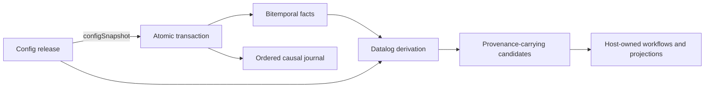

<p align="center">
  <picture>
    <source media="(prefers-color-scheme: dark)" srcset="assets/triplex-logo-dark.svg" />
    
  </picture>
</p>

# Triplex

An Effect-native fact database for applications that have to explain themselves.

[Documentation](https://triplex-docs.bjacobso.workers.dev) ·
[GitHub](https://github.com/bjacobso/triplex) ·
[npm](https://www.npmjs.com/package/@bjacobso/triplex)

Triplex stores what is true, what was true, which versioned rules governed each write, and what
work the data implies. One store answers "what does this record look like today", "what did we
believe last Tuesday", "who changed it and under which policy", and "what tasks should exist right
now", without stitching together a database, an audit log, a config service, and a job queue.

> Pre-1.0 canaries are published to npm under the `next` tag. KV and SQLite are the supported
> baseline; PostgreSQL is a production candidate with a Docker-backed CI integration suite.
> Cloudflare and FoundationDB are experimental. See [Current state](docs/current-state.md) for the
> exact maturity contract.

## Why Triplex?

Most applications keep state in a database and everything that explains that state somewhere else:
policy versions in a config service, audit trails in a log, derived to-dos in a queue. The moment a
regulator, customer, or engineer asks _why_ something happened, the answer has to be reconstructed
across systems that never shared identity or time.

Triplex keeps those concerns separate in the API but gives them one identity model, one clock, and
one provenance chain:

| Primitive   | What it provides                                                                      |
| ----------- | ------------------------------------------------------------------------------------- |
| Triples     | Typed facts, atomic assertions/retractions, history, batching, and pluggable storage  |
| Datalog     | Structural joins, negation, aggregation, recursion, and stable pagination             |
| Journal     | Ordered commits with actor, command, causation, correlation, and config provenance    |
| Config      | Typed Merkle graphs, immutable releases, movable refs, impact, and decision proofs    |
| Derivations | Content-addressed candidates, source provenance, reconciliation, and temporal wakeups |
| Projections | Entity snapshots and validation/materialization state with explicit freshness         |

The layers meet at an application command without collapsing into one model:



**Good fit:** compliance and onboarding systems, policy engines, entitlement and eligibility logic,
back-office workflows, and any domain where "as of when" and "under which rules" are first-class
questions. It also fits agent-driven systems that need a durable, queryable world model with a
causal record of every change.

**Not a fit:** high-volume telemetry, blob storage, or workloads that only need a relational table
and never ask about history or provenance. Triplex is a system of record, not a cache or a queue.

## Installation

Install the current canary explicitly:

```sh
pnpm add @bjacobso/triplex@next effect@4.0.0-rc.112
```

Use `@next` until the reviewed stable `0.1.0` release: npm assigned the initial bootstrap snapshot
to `latest` when the package records were created. Triplex is ESM-only, targets Node.js 22+, and is
aligned to `effect@4.0.0-rc.112`. The browser-safe core also runs in modern browsers and edge
runtimes. The coordinated package and canary process is documented in
[Releasing Triplex](docs/releasing.md).

## Quick start

`Triples` is the primary service. The core package includes an in-memory ordered-KV layer, so the
same program can write facts, read patterns, and run Datalog without another package:

```ts check
import { Effect } from "effect";
import { EntityId, KvTriples, Triples, ref, string } from "@bjacobso/triplex";

const program = Effect.gen(function* () {
  const triples = yield* Triples;
  const alice = EntityId.make("person:alice");
  const acme = EntityId.make("company:acme");

  const tx = yield* triples.transact(
    [
      {
        op: "assert",
        entityId: alice,
        entityType: "Person",
        attribute: ":person/name",
        value: string("Alice"),
      },
      {
        op: "assert",
        entityId: alice,
        entityType: "Person",
        attribute: ":person/employer",
        value: ref(acme),
      },
      {
        op: "assert",
        entityId: acme,
        entityType: "Company",
        attribute: ":company/name",
        value: string("Acme"),
      },
    ],
    {
      actor: "user:ben",
      commandId: "create-person:alice",
      correlationId: "request:123",
    },
  );

  const facts = yield* triples.entity(alice);

  const { results } = yield* triples.query({
    find: ["?personName", "?companyName"],
    where: [
      ["?person", ":person/name", "?personName"],
      ["?person", ":person/employer", "?company"],
      ["?company", ":company/name", "?companyName"],
    ],
  });

  return { position: tx.position, facts, results };
});

Effect.runPromise(program.pipe(Effect.provide(KvTriples.layer)));
```

Assertions may declare `validFrom` and `validTo`. Reads accept one
`{ recordedAt?, validAt? }` basis, which applies coherently to every clause in a query. Retracting a
fact closes its recorded visibility without deleting its assertion history.

Direct writes, entity/pattern reads, reference values, and transactional retractions require
`EntityId` or `TripleId` values. Construct or decode them once at the application boundary instead
of scattering unchecked string casts through domain code. Raw Datalog keeps string literals because
one term can represent an entity, attribute, transaction, rule, or scalar value; its runtime schema
validates identity positions before execution.

Run `pnpm example:demo` for the smallest executable example.

## Integrating Triplex into an application

The quick start shows the store. This walkthrough shows the shape of a real host: a small HR
system that places workers on sites and must make sure each worker has current safety training
for every site they are placed on. The same six steps apply to most Triplex integrations.

```ts check
import { Effect, Layer } from "effect";
import { EntityId, KvTriples, Triples } from "@bjacobso/triplex";
import { Attribute, ConfigStore, EntityType, GraphConstraint } from "@bjacobso/triplex/config";
import * as Derivation from "@bjacobso/triplex/derivation";
import { ConsumerCheckpoint } from "@bjacobso/triplex/operational";

// 1. Describe the domain once. Attributes own identity and type; entity types own usage rules.
const WorkerName = Attribute.text(":worker/name");
const Worker = EntityType.make("Worker", {
  attributes: { name: Attribute.use(WorkerName, { required: true }) },
});

const PlacementWorker = Attribute.ref(":placement/worker", Worker);
const PlacementSite = Attribute.text(":placement/site");
const Placement = EntityType.make("Placement", {
  attributes: {
    worker: Attribute.use(PlacementWorker, { required: true }),
    site: Attribute.use(PlacementSite, { required: true }),
  },
});

const SafetyTraining = Attribute.text(":evidence/site-safety");
const workerId = EntityId.make("worker:maria");
const placementId = EntityId.make("placement:1");

const program = Effect.gen(function* () {
  const triples = yield* Triples;
  const config = yield* ConfigStore.ConfigStore;

  // 2. Publish the schema as an immutable, content-addressed release.
  const release = yield* config.commit({
    label: "hr-2026.1",
    objects: [...(yield* Worker.nodes), ...(yield* Placement.nodes), yield* SafetyTraining.node],
    ref: "live",
  });
  const enforce = GraphConstraint.enforcement([...Worker.constraints, ...Placement.constraints]);

  // 3. Handle an application command as one atomic, attributed transaction.
  yield* triples.transact(
    [
      {
        op: "assert",
        entityId: workerId,
        entityType: "Worker",
        ...Worker.attributes.name.assertion("Maria"),
      },
      {
        op: "assert",
        entityId: placementId,
        entityType: "Placement",
        ...Placement.attributes.worker.assertion(workerId),
      },
      {
        op: "assert",
        entityId: placementId,
        entityType: "Placement",
        ...Placement.attributes.site.assertion("site:harbor"),
      },
    ],
    {
      actor: "user:ben",
      commandId: "placement:create:1", // retried commands return the same receipt
      correlationId: "request:8f2c",
      configSnapshot: release.snapshot.id, // the rules this write was governed by
      enforce, // required/unique/ref-target checks in the same transaction
    },
  );

  // 4. Declare the work the data implies, as a content-addressed Datalog derivation.
  const training = yield* Derivation.make({
    name: "task.site-safety-training",
    query: {
      find: ["?worker", "?site"],
      where: [
        ["?placement", PlacementWorker.key, "?worker"],
        ["?placement", PlacementSite.key, "?site"],
        ["not", ["?worker", SafetyTraining.key, "?site"]],
      ],
    },
    identity: ["?worker", "?site"],
    configSnapshot: release.snapshot.id,
  });

  // 5. A background consumer follows the journal and reconciles the derivation.
  const consumer = "hr/training-materializer";
  const checkpoint = yield* ConsumerCheckpoint.get(triples, consumer);
  const from = checkpoint?.position ?? 0;
  const page = yield* triples.transactions({ after: from, limit: 100 });
  if (page.next !== undefined) {
    const run = yield* Derivation.Materialization.materialize(triples, training, {
      basis: { validAt: Date.now() },
    });
    for (const candidate of run.reconciliation.added) {
      // Replace with your own task/notification system; identity and revision are stable.
      yield* Effect.log(`open training task ${candidate.id} (revision ${candidate.revision})`);
    }
    // run.nextTemporalBoundary tells your scheduler when evidence will expire
    yield* ConsumerCheckpoint.advance(triples, {
      consumer,
      expectedPosition: from,
      nextPosition: page.next,
      meta: { actor: consumer },
    });
  }

  // 6. Answer audit questions later, from the same store.
  const receipt = yield* triples.transactionByCommand("placement:create:1");
  const yesterday = Date.now() - 86_400_000;
  const asOfYesterday = yield* triples.entity(EntityId.make("placement:1"), {
    recordedAt: yesterday,
  });
  return { release: release.snapshot.id, receipt, asOfYesterday };
});

const AppLayer = ConfigStore.layer.pipe(Layer.provideMerge(KvTriples.layer));
// Production: ConfigStore.layer.pipe(Layer.provideMerge(SqliteTriples.layer({ filename: "app.db" })))
await Effect.runPromise(program.pipe(Effect.provide(AppLayer)));
```

The division of labour is deliberate:

| Triplex owns                                                   | Your application owns                                   |
| -------------------------------------------------------------- | ------------------------------------------------------- |
| Facts, history, and the bitemporal read basis                  | Domain vocabulary and entity identifiers                |
| Atomic transactions, command receipts, and the ordered journal | HTTP/queue handlers that turn requests into commands    |
| Config identity, releases, refs, and constraint enforcement    | What a release contains and when `live` moves           |
| Derivation candidates, provenance, and reconciliation diffs    | Task, notification, or workflow lifecycle for each diff |
| Consumer checkpoints and temporal wakeup boundaries            | Timer delivery, retries, and worker scheduling          |

Swapping storage changes only the provided layer. The
[compliance host demo](examples/compliance-host) runs the complete version of this scenario,
including hypothetical previews, evidence expiry, and reopening work without a new source
transaction.

## Typed configuration

Configuration is a tree-shakeable part of the primary package:

```ts
import { Attribute, EntityType } from "@bjacobso/triplex/config";

export const EmployerName = Attribute.text(":employer/name");

export const Employer = EntityType.make("Employer", {
  attributes: {
    name: Attribute.use(EmployerName, {
      required: true,
      unique: true,
    }),
  },
});

Employer.attributes.name.key; // ":employer/name"
Employer.attributes.name.assertion("Acme", { validFrom: Date.now() });
```

The attribute owns its global identity and value type. The entity type owns how it uses that
attribute—requiredness, cardinality, uniqueness, and reference-target constraints. Those nodes can
be committed with forms, policies, routines, and other application-defined config into one
content-addressed release.

`ConfigStore.layer` persists immutable config objects, revisions, release snapshots, and refs
through the same atomic `Triples` boundary. `ConfigRuntime` evaluates against a pinned release;
`EntityValidation` records queryable observations; `GraphConstraint` can opt a command into atomic
required/cardinality/uniqueness/reference-target enforcement.

Read the [configuration guide](docs/configuration.md) for releases, refs, validation, enforcement,
and the exact tamper-evidence guarantee.

## Datalog and derived facts

Raw Datalog is the query API. Patterns join by shared variables, and the portable contract includes
predicates, negation, disjunction, aggregation, ordering, snapshot-stable keyset pagination, and a
bounded binary recursive-rule form. Queries are schema-decoded and semantically validated before
either the KV or SQL engine runs.

`@bjacobso/triplex/derivation` pins a structural query, result identity, type, configuration
snapshot, and dependency set into a content-addressed definition. Evaluation returns candidates
with source triple and assertion-transaction provenance. Pure reconciliation reports added,
removed, changed, and unchanged identities; the application decides whether that means opening a
task, cancelling work, or doing nothing.

Materialized runs retain a source position and return `current`, `stale`, or `unmaterialized`.
Future `validFrom` and `validTo` edges produce a `nextTemporalBoundary`, allowing a host scheduler
to reopen expiry-driven work without polling the whole database. Read-only overlays preview
hypothetical facts without mutating the source store or journal.

- [Datalog guide](docs/datalog.md)
- [Derivations guide](docs/derivations.md)
- [Compliance host demo](examples/compliance-host) — config, facts, feed catch-up, reconciliation,
  hypothetical planning, and expiry-driven reopening in one standalone scenario

## Explorer dashboard

Run the standalone Foldkit dashboard to inspect a real browser-local Triplex database:

```sh
pnpm dashboard
```

Open <http://localhost:4173>. The standalone layer publishes a typed classroom configuration,
records students, teachers, a course, a quiz form, submissions, and a materialized grading
candidate. The dashboard itself is domain-independent: it discovers entity types, attributes,
references, configured derivations, journal entries, and configuration objects from the supplied
Triplex services. The entity browser lists discovered types and opens each as a reflected,
cursor-paginated table pinned to one temporal basis. The form preview renders nodes that explicitly
opt into the portable `triplex.form/v1` contract. The configuration inspector exposes every logical
object and immutable revision, canonical stored bodies, dependency closures, release ancestry, and
moving refs. Swap the demo layer for a host database without changing the inspector.

The package lives at [`packages/dashboard`](packages/dashboard). It uses one app-lifetime Effect
layer as a Foldkit resource; named commands resolve `Triples` and `ConfigStore` from that layer,
while `@foldkit/ui` supplies accessible controls and Tailwind supplies styling.

## Configuration-derived HTTP API

`@bjacobso/triplex-http` compiles persisted entity configuration into validated REST handlers and
OpenAPI 3.1 without retaining the TypeScript DSL declarations. Hosts provide `Triples`,
`ConfigStore`, an authorization layer, and their chosen HTTP server; KV and SQLite share the same
Fetch-level integration suite. Wire objects use full global keywords, writes are atomic and pinned
to one immutable config snapshot, and historical snapshot URLs are read-only by default.

See the [HTTP API guide](docs/http-api.md) and [standalone host](examples/http-api).

## Agent CLI

`@bjacobso/triplex-cli` exposes the same database and configuration services through Effect v4's
typed CLI modules. It is JSON-first, non-interactive, schema-validates external input, and supports
SQLite, PostgreSQL, and database-scoped PostgreSQL:

```sh
pnpm --silent triplex --sqlite ./app.db describe
pnpm --silent triplex --sqlite ./app.db entity types
pnpm --silent triplex --sqlite ./app.db --pretty config object form quiz/bitemporal-facts
pnpm --silent triplex --sqlite ./app.db query run --input query.json
```

Agents can inspect entity types and bitemporal facts, page entity audit history, run or explain raw
Datalog, inspect config objects/revisions/releases/refs and deploy impact, apply attributed atomic
transactions, move refs, and resolve command receipts. Write commands require an actor and unique
command ID. See the [CLI contract and examples](packages/cli/README.md).

## Temporal operations and audit

Every successful application transaction receives a monotonically increasing commit position and
a queryable `_Transaction` envelope. It can retain:

- actor and atomically unique command ID;
- correlation and causation IDs;
- the governing config snapshot; and
- complete typed assertion and retraction changes, including valid intervals and source
  transactions.

`triples.transactions({ after, limit })` is the durable at-least-once catch-up feed.
`ConsumerCheckpoint` persists a compare-and-retract-protected cursor. Best-effort change emitters
are wakeup hints, never a substitute for journal catch-up.

For one entity's audit timeline, use the indexed journal view rather than filtering the global
feed:

```ts
const timeline = Effect.gen(function* () {
  const first = yield* triples.transactionsForEntity(workerId, { limit: 50 });
  const next =
    first.nextBeforePosition === undefined
      ? undefined
      : yield* triples.transactionsForEntity(workerId, {
          limit: 50,
          snapshotPosition: first.snapshotPosition,
          beforePosition: first.nextBeforePosition,
        });

  return { first, next };
});
```

Each page contains complete `TransactionRecord` values, newest first. The first page's commit
position pins later pages while concurrent commands continue to commit.

`queryPage` cursors are versioned, schema-decoded, and bound to the canonical query, ordering,
temporal basis, and database scope. The first page pins an exact commit-position snapshot, so later
writes cannot move rows between pages.

Read [Operational primitives](docs/operational-primitives.md) for the transaction, concurrency,
pagination, projection, and host/runtime boundaries.

## Storage backends

“Supported” describes the current behavioral test boundary, not merely whether a package compiles.

| Package                          | Surface                             | Status                                                        |
| -------------------------------- | ----------------------------------- | ------------------------------------------------------------- |
| `@bjacobso/triplex`              | `KvTriples.layer`                   | Supported in-memory baseline                                  |
| `@bjacobso/triplex-sqlite`       | `SqliteTriples.layer({ filename })` | Supported durable baseline                                    |
| `@bjacobso/triplex-postgres`     | `PgTriples.layer(config)`           | Candidate; shared integration/conformance is currently opt-in |
| `@bjacobso/triplex-cloudflare`   | Durable Object SQLite adapter       | Experimental                                                  |
| `@bjacobso/triplex-foundationdb` | `FdbTriples.layer(config)`          | Experimental                                                  |

`@bjacobso/triplex-sql` contains shared migrations and SQL query execution rather than a database.
`@bjacobso/triplex-testkit` contains the behavioral conformance corpus used by adapters.

Switching the supported quick start to SQLite changes only the provided layer:

```ts
import { SqliteTriples } from "@bjacobso/triplex-sqlite";

const SqliteLive = SqliteTriples.layer({ filename: "app.db" });
```

### PostgreSQL composition

The standalone layer owns its pool and applies Triplex migrations as a convenience:

```ts
import { PgTriples } from "@bjacobso/triplex-postgres";

const TriplexLive = PgTriples.layerFromUrl(process.env.DATABASE_URL!);
```

Production hosts that already own an Effect SQL client can provide that exact client to Triplex.
This path creates no pool and runs no migration:

```ts
import { Effect, Layer } from "effect";
import { SqlClient } from "effect/unstable/sql";
import { EntityId, Triples, string } from "@bjacobso/triplex";
import { PgTriples, makePostgresqlLayerUnmigratedFromUrl } from "@bjacobso/triplex-postgres";

const HostSql = makePostgresqlLayerUnmigratedFromUrl(process.env.DATABASE_URL!);
const AppDatabase = PgTriples.layerFromSqlClient({ scope: "app/main" }).pipe(
  Layer.provideMerge(HostSql),
);

const command = Effect.gen(function* () {
  const sql = yield* SqlClient.SqlClient;
  const triples = yield* Triples;

  yield* sql.withTransaction(
    Effect.gen(function* () {
      yield* sql`INSERT INTO host_records (id) VALUES ('record:1')`;
      yield* triples.transact(
        [
          {
            op: "assert",
            entityId: EntityId.make("record:1"),
            attribute: ":record/status",
            value: string("accepted"),
          },
        ],
        { commandId: "command:1", actor: "user:1" },
      );
      yield* sql`INSERT INTO host_outbox (id) VALUES ('delivery:1')`;
    }),
  );
}).pipe(Effect.provide(AppDatabase));
```

Effect SQL's fiber-local transaction connection is shared by the host statements and nested
`Triples.transact`, so facts, journal, command claim, commit position, host rows, and outbox commit
or roll back together. Nested transactions use Effect SQL savepoints.

For a server-owned logical database mapping, validate the stored ID and create a schema-bound
runtime with `PgTriples.layerForDatabase(config, DatabaseId.make("customer-a"))`. Every connection
in that pool starts in the deterministic Triplex schema, and its scope is embedded in pagination
cursors. The schema and v1 migration must already exist; `layerForDatabaseMigrated` is the explicit
provisioning convenience for setup tools and tests.

Triplex exports the ordered `migrations` and `runMigrations` from `@bjacobso/triplex-sql`.
Production hosts should run them from their own deployment process against the same database or
schema before constructing an unmigrated runtime. Triplex uses `triplex_schema_migrations`, not the
host application's migration table.

## Package entrypoints

```ts
import { Triples, KvTriples } from "@bjacobso/triplex";
import { DatalogQuery } from "@bjacobso/triplex/datalog";
import { SubscriptionManager } from "@bjacobso/triplex/subscriptions";
import { ConfigStore, TypeExpr } from "@bjacobso/triplex/config";
import { ContentId } from "@bjacobso/triplex/content";
import * as Derivation from "@bjacobso/triplex/derivation";
import { ConsumerCheckpoint } from "@bjacobso/triplex/operational";
```

Application code should use these public surfaces. `@bjacobso/triplex/internal` is the unstable SPI
for Triplex adapter packages. Public exports resolve only to built `dist` files.

## Documentation

| Document                                                 | Purpose                                             |
| -------------------------------------------------------- | --------------------------------------------------- |
| [Current state](docs/current-state.md)                   | Delivered behavior, maturity, limitations, releases |
| [Datalog](docs/datalog.md)                               | Query syntax and backend-independent semantics      |
| [Configuration](docs/configuration.md)                   | Types, releases, refs, validation, and proofs       |
| [Derivations](docs/derivations.md)                       | Candidates, provenance, materialization, overlays   |
| [Operational primitives](docs/operational-primitives.md) | Transactions, journal, concurrency, projections     |
| [Architecture](ARCHITECTURE.md)                          | Package boundaries and dependency direction         |
| [Roadmap](docs/roadmap.md)                               | Release gates and future work                       |
| [Host integration](docs/host-integration.md)             | Runtime composition and data-migration guidance     |
| [Source provenance](docs/provenance.md)                  | Imported repository history                         |

The focused configuration explorer remains under [`examples/config-explorer`](examples/config-explorer),
and the full database dashboard lives under [`packages/dashboard`](packages/dashboard).

## Development

```sh
pnpm install --frozen-lockfile
pnpm check
pnpm pack:check
```

PostgreSQL and FoundationDB integration suites are opt-in:

```sh
pnpm test:postgres:integration
pnpm test:foundationdb:integration
```

See [CONTRIBUTING.md](CONTRIBUTING.md) for the complete contribution contract.

## License

MIT © 2026 Ben Jacobson.
